# Ural Monorepo

Монорепозиторий backend-сервисов проекта `Ural`.

## Состав

- `ural-aggregator` - API gateway/aggregator для проксирования запросов к доменным сервисам
- `ural-auth` - сервис аутентификации, авторизации и JWT
- `ural-users` - сервис пользователей и рейтингов
- `ural-cars` - сервис автомобилей и заявок на AI-анализ фотографий
- `ural-cargo` - сервис грузов
- `ural-contracts` - сервис договоров и маршрутов
- `ural-files` - сервис файлов с хранением в MinIO
- `ural-gai` - mock-сервис внешних проверок ГАИ/Autocode
- `ural-notifications` - сервис уведомлений и email-рассылки
- `ural-ai` - сервис AI-анализа
- `ural-front` - React frontend, который обращается к backend через `ural-aggregator`
- `ural-common-starter` - общий набор Spring Boot starter-модулей; отдельный Docker-образ для него не собирается

## Быстрый Старт

1. Создайте локальный `.env` на основе `.env.example`:

```bash
cp .env.example .env
```

2. Запустите весь стек из корня монорепозитория:

```bash
docker compose up --build -d
```

3. Проверьте статус контейнеров:

```bash
docker compose ps
```

4. Дождитесь статуса `healthy` у сервисов и инфраструктуры. Все Java-сервисы запускаются с профилем `dev` через `SPRING_PROFILES_ACTIVE=dev`.

5. Откройте frontend:

```bash
http://localhost:3000
```

В общем Docker-запуске `ural-front` получает `API_BASE_URL=http://localhost:10902`, поэтому все запросы из браузера идут в `ural-aggregator`, а уже он проксирует их в доменные backend-сервисы.

## Доступные Сервисы

- aggregator API: `http://localhost:10902`
- frontend: `http://localhost:3000`
- auth API: `http://localhost:10901`
- users API: `http://localhost:10903`
- cars API: `http://localhost:10904`
- cargo API: `http://localhost:10905`
- contracts API: `http://localhost:10906`
- files API: `http://localhost:10907`
- gai mock API: `http://localhost:10908`
- notifications API: `http://localhost:10909`
- ai API: `http://localhost:10910`
- PostgreSQL: `localhost:10900`
- Kafka: `localhost:11009`
- MinIO API: `http://localhost:9000`
- MinIO Console: `http://localhost:9001`
- Mailpit UI: `http://localhost:8025`

## Структура Запуска

Корневой `docker-compose.yml` поднимает:

- `ural-postgres` - PostgreSQL с базой `ural`
- `ural-kafka` - Kafka в KRaft-режиме
- `ural-minio` - S3-compatible хранилище для `ural-files`
- `ural-minio-init` - one-shot контейнер для создания bucket `files`
- `ural-mailpit` - локальный SMTP и web-интерфейс писем
- `ural-auth`
- `ural-users`
- `ural-gai`
- `ural-cargo`
- `ural-cars`
- `ural-files`
- `ural-notifications`
- `ural-contracts`
- `ural-ai`
- `ural-aggregator`
- `ural-front` - nginx с production-сборкой React-приложения; зависит от `ural-aggregator` и на старте пишет `public/runtime-config.js` с URL агрегатора

Для каждого запускаемого подпроекта собирается отдельный Docker-образ с тегом `*:dev`. `ural-common-starter` используется как библиотека в Maven reactor и не запускается отдельным контейнером.

Это основной поддерживаемый `docker compose` сценарий для монорепозитория.

P.s. для полноценной работы приложения нужны API KEYS для Gemini и GraphHopper.

## Docker-Сборка

Корневой `Dockerfile` собирает сервисы из исходников через Maven:

```bash
mvn -pl <project>/<service-module> -am package -DskipTests
```

В Docker-сборке внутренние версии переопределяются на локальные версии модулей монорепозитория:

- `ural-common-starter.version=1.18-SNAPSHOT`
- `ural-security.version=1.9-SNAPSHOT`
- `ural-auth.version=1.9-SNAPSHOT`
- `ural-users-api.version=1.1-SNAPSHOT`

Это нужно, чтобы образы собирались из текущего checkout, а не из старых published artifacts.

## Корневая Java-Сборка

Корневой `pom.xml` объединяет подпроекты в единый Maven reactor:

```bash
mvn package -DskipTests \
  -Dural-common-starter.version=1.18-SNAPSHOT \
  -Dural-security.version=1.9-SNAPSHOT \
  -Dural-auth.version=1.9-SNAPSHOT \
  -Dural-users-api.version=1.1-SNAPSHOT
```

Собрать отдельный сервис с зависимостями:

```bash
mvn -pl ural-auth/ural-auth-service -am package -DskipTests \
  -Dural-common-starter.version=1.18-SNAPSHOT \
  -Dural-security.version=1.9-SNAPSHOT \
  -Dural-auth.version=1.9-SNAPSHOT \
  -Dural-users-api.version=1.1-SNAPSHOT

mvn -pl ural-aggregator/ural-aggregator-service -am package -DskipTests \
  -Dural-common-starter.version=1.18-SNAPSHOT \
  -Dural-security.version=1.9-SNAPSHOT \
  -Dural-auth.version=1.9-SNAPSHOT \
  -Dural-users-api.version=1.1-SNAPSHOT
```

## Основные Переменные Окружения

В `.env.example` перечислены основные переменные для локального запуска:

- `PUBLIC_KEY`, `PRIVATE_KEY`
- `POSTGRES_*`
- `KAFKA_PORT`
- `MINIO_*`
- `MAIL_*`
- `AGGREGATOR_PORT`, `FRONT_PORT`, `AUTH_PORT`, `USERS_PORT`, `CARS_PORT`, `CARGO_PORT`, `CONTRACTS_PORT`, `FILES_PORT`, `GAI_PORT`, `NOTIFICATIONS_PORT`, `AI_PORT`
- `GEMINI_API_KEY`, `GEMINI_MODEL`
- `GRAPHHOPPER_API_KEY`, `GRAPHHOPPER_PROFILE`, `GRAPHHOPPER_LOCALE`

Demo RSA keypair в `.env.example` предназначен только для локального dev-запуска.

## Полезные Команды

Остановить стек:

```bash
docker compose down
```

Остановить стек и удалить volumes:

```bash
docker compose down -v
```

Пересобрать и поднять заново:

```bash
docker compose up --build -d
```

Посмотреть логи:

```bash
docker compose logs -f
```

Посмотреть логи конкретного сервиса:

```bash
docker compose logs -f ural-auth
```

Экран с формой логина
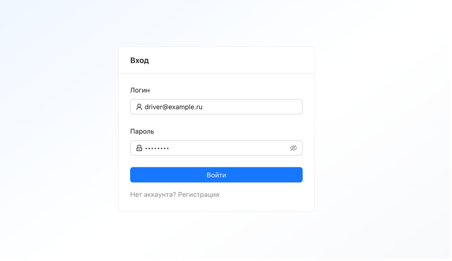

Экран регистрации
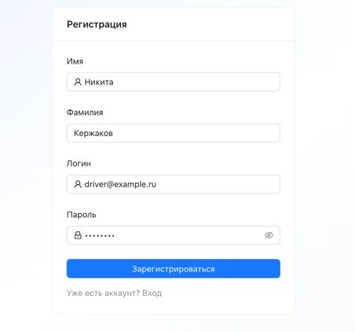

Экран грузов
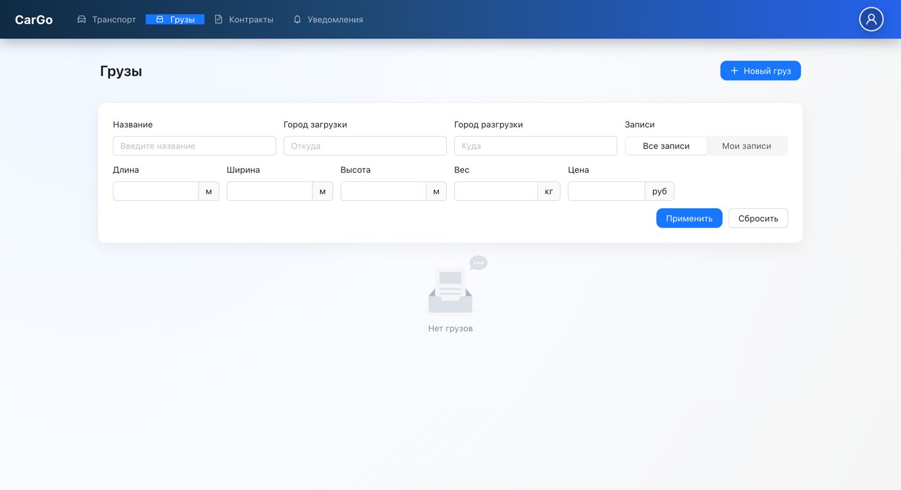

Экран транспортов
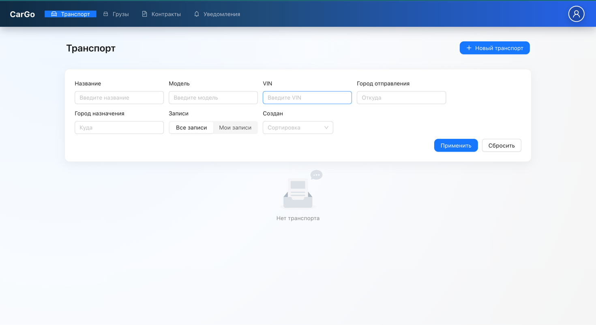

Экран контрактов
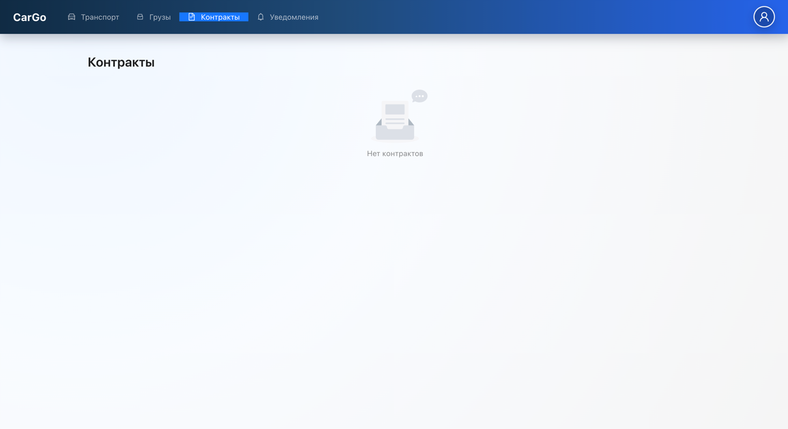

Экран уведомлений
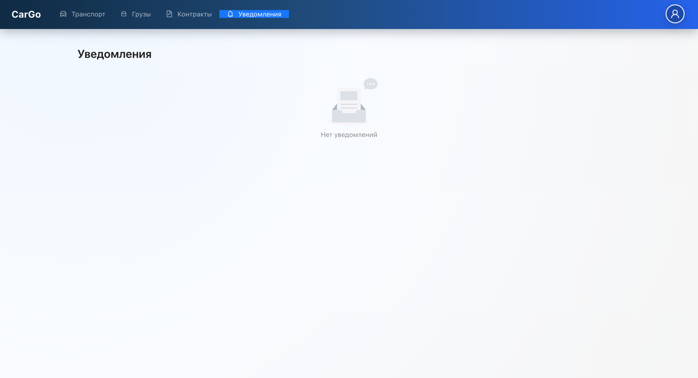

Экран профиля
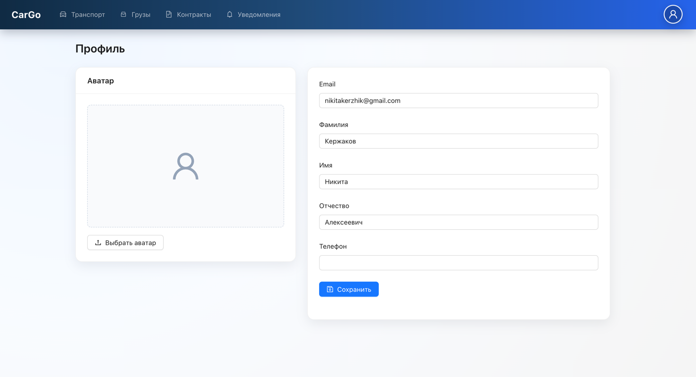

Экран созданного транспорта
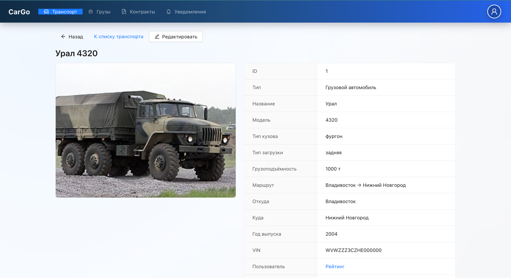

Экран транспортов с существующим транспортом
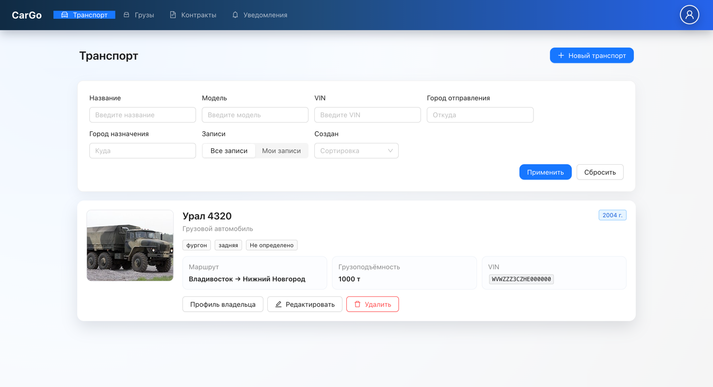

Экран созданного груза
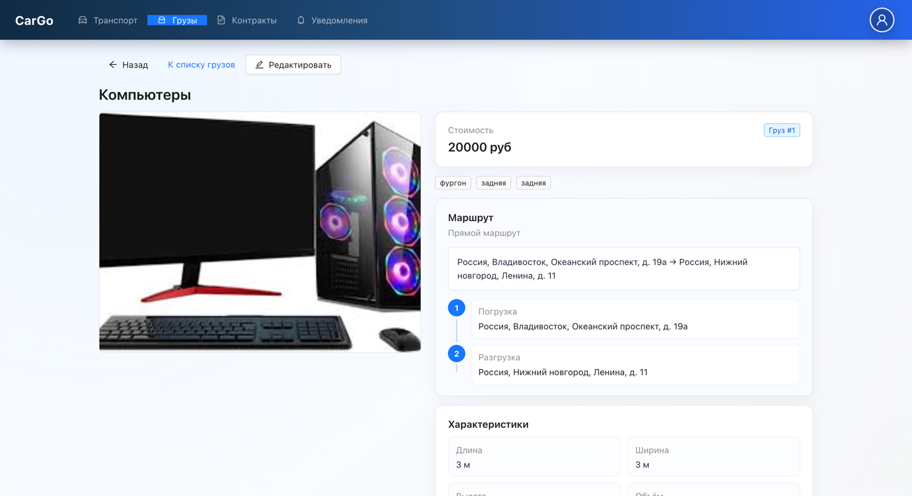

Экран с грузами
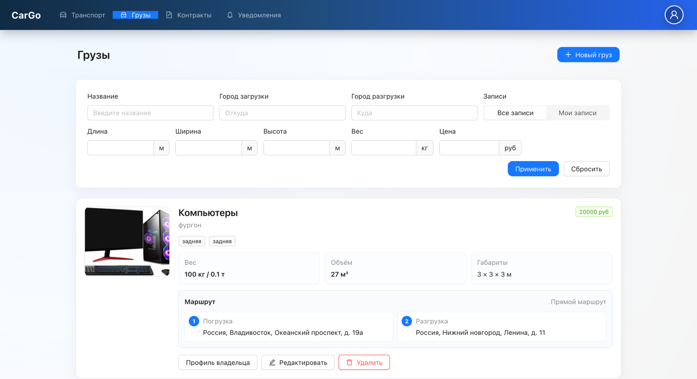

Экран с созданным контрактом
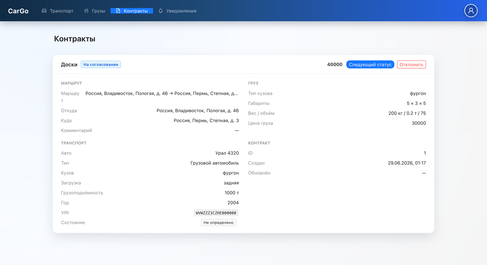

Экран с уведомлением
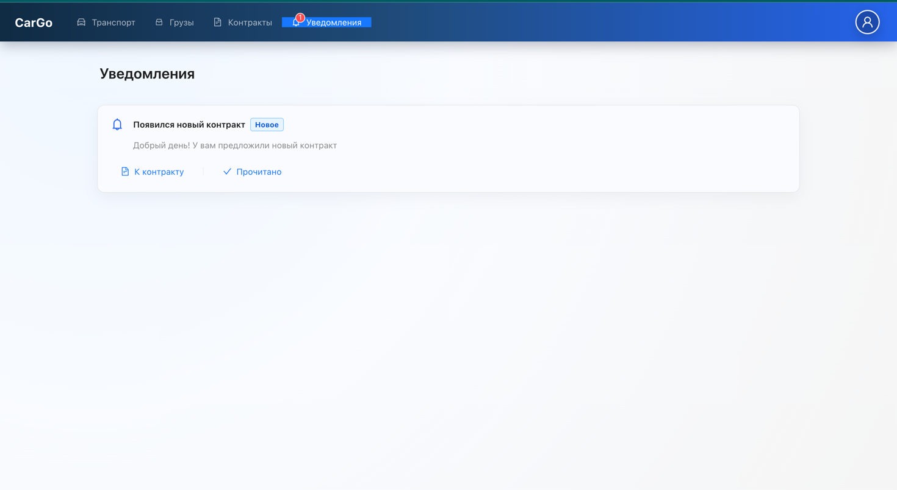

Страница контракта
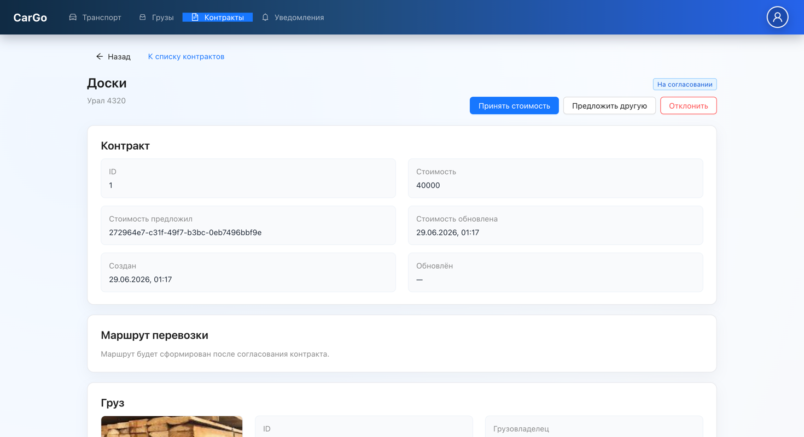

Ссылка на оригинальный репозиторий: https://github.com/VoRaX00/Ural-monorepo
